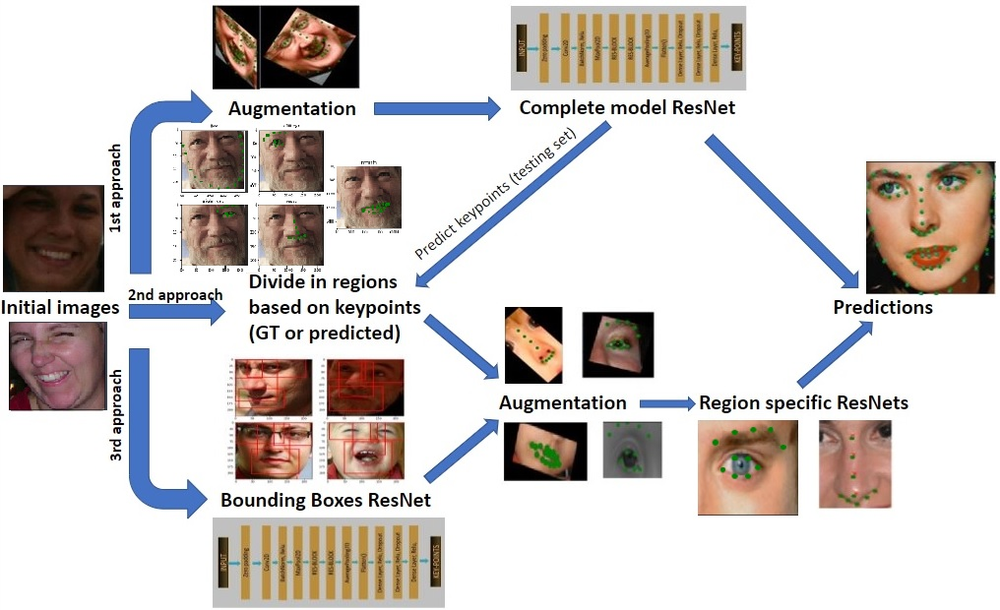

Project made for the course Vision and Cognitive Services of 2021 (UniPd).

In the context of the 300w challenge, a series of methods based on ResNet architecture were built from scratch, in order to accurately predict 68 facial keypoints.
Final results demonstrate that the methods applied, outperform past winners of the challenge by a small margin.

A diagram of the methods considered:

